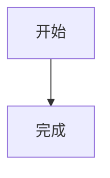

# Mermaid Rendering Implementation Plan

> **For agentic workers:** REQUIRED SUB-SKILL: Use sp-subagent-driven-development (recommended) or sp-executing-plans to implement this plan task-by-task. Steps use checkbox (`- [ ]`) syntax for tracking.

**Goal:** Render Markdown fenced blocks tagged `mermaid` as diagrams in both published article pages and the writing preview.

**Architecture:** Keep Mermaid out of the server Markdown renderer. `renderMarkdown` will emit a safe placeholder for Mermaid code blocks, while the existing `useMarkdownRender` parser will replace that placeholder with a client-only `MermaidDiagram` component. The component lazy-loads Mermaid, renders SVG in the browser, and falls back to readable source code when rendering fails.

**Tech Stack:** `marked` 17, `html-react-parser`, React 19, Mermaid, Node's built-in `node:test`, OpenNext for Cloudflare.

## Global Constraints

- Support code block language marker `mermaid` case-insensitively.
- Apply the same behavior to the article detail page and writing preview because both use `useMarkdownRender`.
- Preserve ordinary Shiki-highlighted code blocks and their copy behavior.
- Keep Mermaid client-only so the Cloudflare Worker does not execute Mermaid during server rendering.
- Mermaid syntax errors and dependency loading failures must not prevent the rest of the article from rendering.
- Do not add a Mermaid editor, export action, zoom controls, or server-side SVG persistence.

---

### Task 1: Add the Mermaid dependency and renderer regression tests

**Files:**
- Create: `scripts/markdown-renderer.test.ts`
- Modify: `package.json`
- Modify: `pnpm-lock.yaml`

**Interfaces:**
- Consumes: `renderMarkdown(markdown: string)` from `src/lib/markdown-renderer.ts`.
- Produces: a repeatable test command for Mermaid placeholder output and ordinary code output.

- [ ] **Step 1: Write the failing tests**

Create `scripts/markdown-renderer.test.ts`:

```ts
import assert from 'node:assert/strict'
import test from 'node:test'
import { renderMarkdown } from '../src/lib/markdown-renderer.ts'

test('renders Mermaid code blocks as diagram placeholders', async () => {
	const { html } = await renderMarkdown('```Mermaid\nflowchart TD\n  A[Start] --> B[End]\n```')

	assert.match(html, /data-mermaid-chart=/)
	assert.doesNotMatch(html, /data-code=/)
})

test('keeps ordinary code blocks on the existing highlighted path', async () => {
	const { html } = await renderMarkdown('```ts\nconst answer = 42\n```')

	assert.match(html, /<pre data-code=/)
})
```

- [ ] **Step 2: Run the tests and verify the new behavior fails**

Run:

```bash
node --experimental-strip-types --test scripts/markdown-renderer.test.ts
```

Expected: the Mermaid test fails because the current renderer treats `Mermaid` as an ordinary code block; the ordinary code test passes.

- [ ] **Step 3: Add Mermaid without changing application code**

Run:

```bash
pnpm add mermaid
```

Expected: `package.json` and `pnpm-lock.yaml` contain the Mermaid runtime dependency.

- [ ] **Step 4: Commit the dependency and regression test**

```bash
git add scripts/markdown-renderer.test.ts package.json pnpm-lock.yaml
git commit -m "test: cover mermaid markdown blocks"
```

### Task 2: Emit a safe Mermaid placeholder from the Markdown renderer

**Files:**
- Modify: `src/lib/markdown-renderer.ts`
- Test: `scripts/markdown-renderer.test.ts`

**Interfaces:**
- Consumes: `Tokens.Code.lang` and `Tokens.Code.text` from `marked`.
- Produces: `<div data-mermaid-chart="..."></div>` for Mermaid blocks; existing `<pre data-code="..."></pre>` for all other blocks.

- [ ] **Step 1: Implement case-insensitive Mermaid detection**

In the `renderer.code` callback, detect Mermaid with:

```ts
const isMermaid = token.lang?.trim().toLowerCase() === 'mermaid'
```

For Mermaid, return a `div` whose `data-mermaid-chart` attribute contains the original chart text. Escape `&`, `"`, `'`, `<`, and `>` before placing the text in the attribute. In the Shiki preprocessing loop, skip Mermaid tokens so they never enter `codeBlockMap` or get sent to Shiki.

- [ ] **Step 2: Run the focused tests and verify they pass**

Run:

```bash
node --experimental-strip-types --test scripts/markdown-renderer.test.ts
```

Expected: both tests pass, including the mixed-case `Mermaid` marker.

- [ ] **Step 3: Commit the server-safe placeholder change**

```bash
git add src/lib/markdown-renderer.ts scripts/markdown-renderer.test.ts
git commit -m "feat: mark mermaid markdown blocks"
```

### Task 3: Add the client-side Mermaid renderer with fallback behavior

**Files:**
- Create: `src/components/mermaid-diagram.tsx`

**Interfaces:**
- Consumes: `MermaidDiagram({ chart: string })` from the Markdown parser.
- Produces: an SVG diagram after client-side rendering, or a readable source-code fallback after a load/render error.

- [ ] **Step 1: Implement the client component**

Create a `'use client'` component with this public shape:

```tsx
type MermaidDiagramProps = { chart: string }
export function MermaidDiagram({ chart }: MermaidDiagramProps) { /* ... */ }
```

Use `useId()` to create a stable DOM-safe Mermaid render ID. Lazy-load Mermaid inside `useEffect`, initialize it with `startOnLoad: false` and `securityLevel: 'strict'`, and call `mermaid.render(id, chart)`. Store the returned SVG in state and inject only the generated SVG into a diagram container. If loading or rendering throws, render a short Chinese error label plus the original chart in a `pre`/`code` fallback. Ignore late async results after unmount.

- [ ] **Step 2: Commit the isolated client renderer**

```bash
git add src/components/mermaid-diagram.tsx
git commit -m "feat: render mermaid diagrams on the client"
```

### Task 4: Connect the placeholder to Markdown parsing and style the diagram

**Files:**
- Modify: `src/hooks/use-markdown-render.tsx`
- Modify: `src/styles/article.css`

**Interfaces:**
- Consumes: `data-mermaid-chart` placeholders emitted by `renderMarkdown`.
- Produces: `MermaidDiagram` React elements inside the existing parsed article content.

- [ ] **Step 1: Replace Mermaid placeholders in the parser**

Import `MermaidDiagram` and add a replacement branch before the existing image branch:

```tsx
if (domNode instanceof Element && domNode.name === 'div' && domNode.attribs['data-mermaid-chart'] !== undefined) {
	return <MermaidDiagram chart={domNode.attribs['data-mermaid-chart']} />
}
```

Leave the current `data-code` extraction and `CodeBlock` replacement unchanged.

- [ ] **Step 2: Add minimal article styles**

Add styles for `.prose .mermaid-diagram` and its SVG so the diagram is centered, constrained to the article width, and horizontally scrollable when necessary. Add styles for `.prose .mermaid-error` and `.prose .mermaid-fallback` so syntax errors remain readable and do not inherit the copy-button wrapper behavior.

- [ ] **Step 3: Run the renderer tests and build**

Run:

```bash
node --experimental-strip-types --test scripts/markdown-renderer.test.ts
pnpm run build:cf
```

Expected: the focused tests pass and the Cloudflare build exits with code 0.

- [ ] **Step 4: Commit the integration**

```bash
git add src/hooks/use-markdown-render.tsx src/styles/article.css
git commit -m "feat: integrate mermaid into article rendering"
```

### Task 5: Verify published article and writing preview behavior

**Files:**
- No source changes expected.

**Interfaces:**
- Consumes: the completed Markdown-to-Mermaid rendering path.
- Produces: evidence that Mermaid and ordinary code work in both user-facing contexts.

- [ ] **Step 1: Run the existing guestbook regression test**

```bash
pnpm test:guestbook
```

Expected: all existing guestbook tests pass.

- [ ] **Step 2: Verify the writing preview in a local browser**

Start the dev server with `pnpm dev`, open `/write`, enter:

````markdown

````

Open the preview and confirm an `svg` exists inside `.mermaid-diagram`. Also enter a `ts` fenced block and confirm its existing code block and copy button remain present.

- [ ] **Step 3: Verify the published article path**

Use an existing article or the same Markdown source through the article detail route and confirm the same Mermaid SVG behavior, with no console errors and no Mermaid source rendered as a normal code block when rendering succeeds.

- [ ] **Step 4: Review the final diff and status**

```bash
git diff --check
git status --short
git log -6 --oneline
```

Expected: only Mermaid-related files are changed by this work; pre-existing untracked user images remain untouched.
